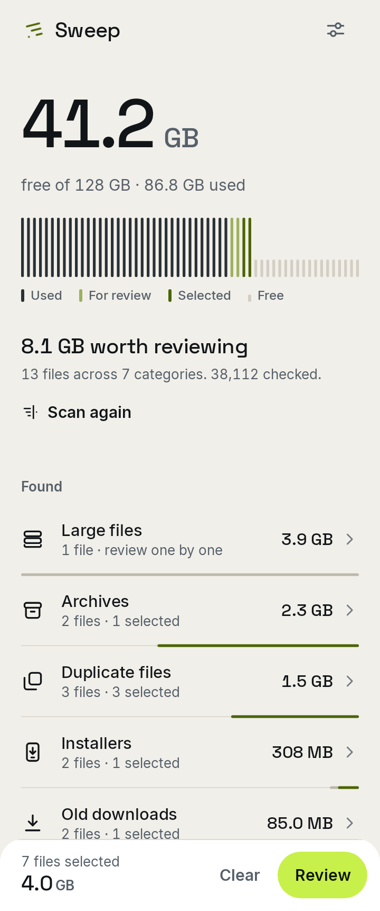
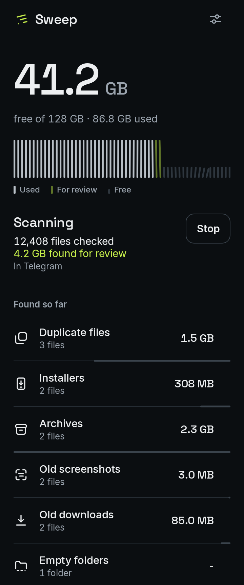
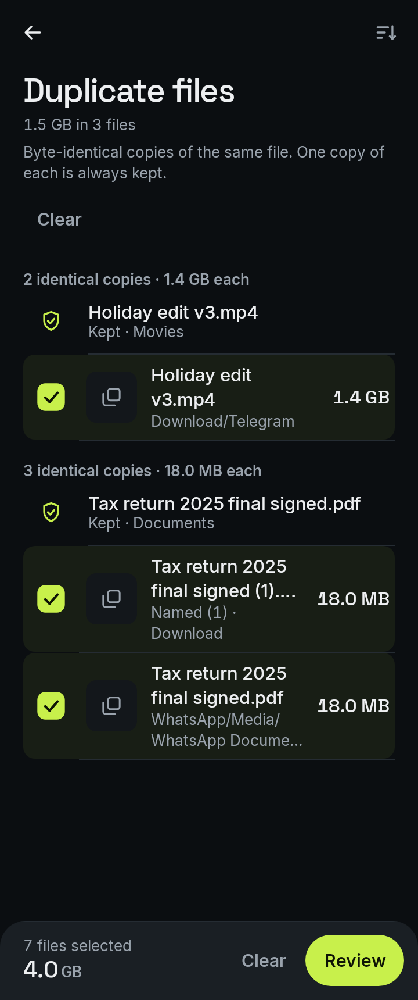

# Sweep

An Android storage cleanup app built as a personal portfolio project.

Sweep scans the storage it is allowed to see, groups what it finds into categories, and lets you review each file before anything is deleted. Everything happens on the device.

This is a **functional personal project**, not a commercial release. It works, it has been used on real phones, and it is not on any app store.

Earlier versions were tested across **five physical Android devices**. v0.6 keeps the same cleanup engine and has now also been run on a physical Galaxy S23 as part of the redesign testing. The redesign is functional, but its storage-capacity presentation and scan motion are still being refined for v0.7. See [Development status](#development-status).

<p>
  
  
  
</p>

<sub>Rendered from the app's layout tests with sample data.</sub>

---

## Quick install

A prebuilt **v0.6.0 debug APK** is included for easy testing:

**[Download Sweep v0.6.0 debug APK](apk/Sweep-v0.6.0-debug.apk)**

Checksum:

**[Sweep-v0.6.0-debug.apk.sha256](apk/Sweep-v0.6.0-debug.apk.sha256)**

```text
22a4305fa128c599e0119e961d4c54e09dee197b2adf7496da9fb5ff4fd25698
```

This is a development build signed with Android's debug signing identity. Android or security software may warn because it is installed manually and Sweep requests powerful storage/usage permissions. The debug build uses the `dev.sweep.debug` application ID, so it can normally sit alongside a release build.

For development, signed tester builds, and Play-oriented App Bundles, use the build instructions below.

---

## What it does

| Feature | What it does | Status |
| --- | --- | --- |
| Storage scan | Walks accessible storage and groups cleanup candidates | Working |
| Duplicate files | Finds byte-identical copies, shows which one is kept, and never pre-selects it | Working |
| Large files | Lists unusually large files for manual review | Working, never pre-selected |
| Old downloads | Finds older files sitting in Downloads | Working, media never pre-selected |
| Installers | Finds leftover APK and install files | Working |
| Archives | Finds ZIP, RAR, 7z and similar archives | Working |
| Old screenshots | Shows older screenshots for review | Working, never pre-selected |
| Empty folders | Finds folders with nothing in them | Working |
| File preview | Shows the file large, with its details, and opens it in an installed app | Working |
| Review and delete | Itemised confirmation, then reports what actually got deleted | Working |
| App cache | Shows cache sizes, opens each app's Android storage page, measures again when you return | Working, Android does the clearing |
| Unused apps | Uses Android's usage history to find apps you stopped opening | Device-dependent |
| Uninstall | Opens Android's uninstall dialog, then verifies the result | Working |
| Reminders | Optional weekly note about storage worth reviewing or newly unused apps | Working, off by default |
| Reduced motion | Keeps every change of state, removes the movement | Working |
| Haptics | Short feedback on selection, deletion and completion | Working |

Unused apps is marked device-dependent on purpose. Sweep reads every usage source Android exposes, but some devices report very little history. Apps with no usable history are listed separately under **Usage unknown** rather than being guessed at.

Reminders are off until you turn them on in Settings, and Sweep only asks for notification permission at that moment. They are checked about once a week through WorkManager, when the battery is not low, and never within a few days of you opening Sweep. The cleanup reminder quotes what your last real scan measured, with its date, and stops once that scan is more than 45 days old. The unused-app reminder only speaks when the count has grown, and ignores anything under Usage unknown.

---

## How it looks, and why

Storage is drawn as a tally: tall strokes for space in use, short stubs for free space, and whatever a scan finds collected in lime at the edge of the used part. During a scan a front passes through the strokes, and its speed follows how busy the scanner actually is. Nothing in the app moves unless something is happening, and nothing claims space is free until Android has measured it again.

The reasoning, and what was removed to get here, is in [docs/DESIGN_EXPLORATION_V06.md](docs/DESIGN_EXPLORATION_V06.md).

---

## Running Sweep

You need [Android Studio](https://developer.android.com/studio) and **JDK 17 or 21**.

Recent Android Studio versions bundle JDK 25, which this project's Gradle and Kotlin versions cannot run on. If the sync fails with nothing but a version number as its error, open **Settings > Build, Execution, Deployment > Build Tools > Gradle** and set **Gradle JDK** to a 17 or 21 installation.

1. Clone or download the repository.
2. Open the project **root folder** in Android Studio, not the `app` folder.
3. Wait for the Gradle sync to finish. Studio will offer to install the Android SDK components it needs, including **SDK Platform 36**.
4. Connect a phone by USB, or create an emulator in Device Manager.
5. On a physical phone, enable **Developer options** by tapping Build number in Settings seven times, then turn on **USB debugging**.
6. Pick the device in the toolbar dropdown.
7. Run the `app` configuration.
8. Sweep opens straight to Home. It asks for storage access where the scan button would be, and for Usage Access when you open Apps. Both are optional, and the app says what is unavailable without them.

A physical device is much better than an emulator here. Real storage, real installed apps, real usage history, real cache sizes and the actual uninstall flow are all things an emulator either fakes or does not have.

**If Usage Access will not turn on:** Android restricts sensitive settings for apps installed manually rather than from a store, and the switch can appear greyed out or say the app was denied access. Open Sweep's App info, open the menu in the top right, choose **Allow restricted settings**, then try again. The wording varies between manufacturers. Sweep shows these steps in the app, and opens them by itself if you come back from the settings screen without the permission.

---

## Tests

```bash
./gradlew testDebugUnitTest
```

Unit tests cover the scanner, duplicate finder, safety rules, deletion, usage history and reminder rules against real files on disk. Layout tests render every main screen on the JVM at 320dp, at 200% text, in both themes and with reduced motion, and check that the facts each screen exists for stay visible.

To look at those renders yourself:

```bash
./gradlew testDebugUnitTest -Psweep.shots
```

The images land in `app/build/shots/`.

---

## Building a tester APK

**Debug build**, for your own development:

```bash
./gradlew assembleDebug
```

The APK is at `app/build/outputs/apk/debug/`. Debug builds install alongside a release build, since they use the `dev.sweep.debug` application ID, and Settings shows which build you are running.

**Signed release build**, for sending to someone else. You need your own signing key.

1. Create a key if you do not have one. In Android Studio: **Build > Generate Signed App Bundle / APK > APK > Create new**. Keep the `.jks` file somewhere outside the repository, and back it up. Losing it means you cannot update an installed app.

2. Copy `keystore.properties.example` to `keystore.properties` in the project root and fill in your values:

   ```properties
   storeFile=C:/path/to/sweep-release.jks
   storePassword=...
   keyAlias=sweep
   keyPassword=...
   ```

   The same four values can come from the `SWEEP_STORE_FILE`, `SWEEP_STORE_PASSWORD`, `SWEEP_KEY_ALIAS` and `SWEEP_KEY_PASSWORD` environment variables instead.

3. Build it:

   ```bash
   ./gradlew releaseApkInfo
   ```

   This assembles the release APK and prints its name, size, signing status and SHA-256 checksum. `./gradlew assembleRelease` also works if you only want the file.

The result is `app/build/outputs/apk/release/Sweep-v0.6.0-release.apk`. Without a keystore configured the build still succeeds and produces `Sweep-v0.6.0-release-unsigned.apk`, which Android will refuse to install.

Send the checksum along with the APK so the person receiving it can confirm the file arrived intact.

**For Google Play**, build an App Bundle instead:

```bash
./gradlew releaseBundleInfo
```

That produces `app/build/outputs/bundle/release/Sweep-v0.6.0-release.aab` and prints the same details. Play re-signs uploads with its own key through Play App Signing, so the key configured here is the upload key in that context. Sweep has not been submitted to Play, and two of its permissions need a declaration form with an uncertain outcome. See [docs/PLAY_STORE_READINESS.md](docs/PLAY_STORE_READINESS.md).

**Never commit** the `.jks` keystore, `keystore.properties`, or any password. Both are already in `.gitignore`. The single prebuilt debug APK under `apk/` is intentionally tracked for quick testing. Signed release APKs and App Bundles should normally be attached to GitHub Releases rather than accumulated in the source tree.

A note on installing: sideloaded apps are unknown to Play Protect, and Android will warn about them. Signing the APK does not change that, and neither does anything else Sweep can do. Some antivirus apps are also suspicious of anything that requests broad storage access, which Sweep genuinely needs in order to work at all. A Play-distributed build would follow a different trust path, but since Sweep has never been through Play review, that is an expectation rather than something tested.

---

## Permissions and privacy

Sweep declares seven permissions and has no networking.

| Permission | Why | Without it |
| --- | --- | --- |
| `MANAGE_EXTERNAL_STORAGE` | Read and delete files across shared storage on Android 11+ | No file scanning |
| `READ_EXTERNAL_STORAGE`, `WRITE_EXTERNAL_STORAGE` | The same thing on Android 8 to 10, where they still apply | No file scanning |
| `PACKAGE_USAGE_STATS` | Last-opened dates and per-app storage sizes | No unused apps, no cache sizes |
| `QUERY_ALL_PACKAGES` | Seeing the installed app list at all, under Android 11+ package visibility | The app list is nearly empty |
| `REQUEST_DELETE_PACKAGES` | Launching Android's uninstall dialog | Uninstall silently does nothing |
| `POST_NOTIFICATIONS` | Optional reminders, requested only when you switch one on | No reminders, everything else unaffected |

WorkManager adds `WAKE_LOCK` and `RECEIVE_BOOT_COMPLETED` to the built app, which is how a scheduled reminder finishes and how it survives a reboot. It would also have added `ACCESS_NETWORK_STATE` and `FOREGROUND_SERVICE`; both are removed in the manifest, because Sweep's job declares no network constraint and never runs expedited work.

There is no `INTERNET` permission, so file lists and app names cannot leave the device even by accident. No account, no analytics, no crash reporting. Settings and the exclusion list live in local storage.

The two storage permissions and Usage Access are genuinely powerful, and Sweep does not pretend otherwise. Both are granted from Android's own settings screens, and Sweep can only open those screens for you.

---

## Known limitations

- **Nominal storage capacity is still being corrected.** On the tested 256 GB Galaxy S23, v0.6 can display roughly 275 GB as total capacity even though the phone is sold as 256 GB. Free-space readings remain based on Android's storage APIs, but the user-facing capacity label needs normalization and cross-device verification. This is a v0.7 priority.
- **Usage history varies by device.** Sweep reads foreground events and all four usage buckets, but it cannot invent history a device never recorded. Apps without it stay under Usage unknown.
- **Restricted Settings.** Android blocks sensitive toggles like Usage Access for apps whose installer did not use the session-based install API, which covers most manual installs. Store installs and `adb install` are unaffected, which is why the same APK is restricted on one phone and not another. Nothing in the app changes this, so Sweep explains the "Allow restricted settings" step instead, and only to people who hit it.
- **Reminders are inexact by design.** WorkManager decides when the weekly check runs. Nothing here is urgent enough to wake a phone.
- **Sweep cannot clear another app's cache.** No third-party app can. It shows the sizes, opens the relevant Android page, and measures again afterwards.
- **Sweep cannot uninstall anything itself.** It opens Android's dialog and checks afterwards whether the package is gone.
- **Deletions are permanent.** There is no recycle bin, and the confirmation sheet says so.
- **Play Store distribution is uncertain.** `MANAGE_EXTERNAL_STORAGE` and `QUERY_ALL_PACKAGES` both need a Permissions Declaration Form, and cleanup apps are not an explicitly listed permitted use for package visibility. The build requirements are met; the policy outcome is unknown. See [docs/PLAY_STORE_READINESS.md](docs/PLAY_STORE_READINESS.md).
- **Exact duplicates only.** No perceptual or similar-image matching.

---

## Development status

**Functional MVP, redesigned.** Core scanning, review, deletion, preview, cache reporting and unused-app detection were already validated on real hardware before the redesign. v0.6 replaces the interface around that engine: Home, the storage picture, scan presentation, file review, preview, Apps, Settings, icons and launch behavior.

The v0.6 codebase passes its automated checks and has now also been run on a physical Galaxy S23. The new information architecture and file-review flow are working, while two areas are intentionally still under active refinement: the scan/storage visual language and the user-facing nominal capacity label.

Automated verification for v0.6 includes **100 tests**, lint, debug/release APK builds, an App Bundle build, narrow-width/large-text layout renders, both themes and Reduced Motion.

Next up:

- a stronger signature scan interaction for v0.7;
- correcting the 256 GB / 275 GB capacity-label mismatch without corrupting real byte calculations;
- refining the custom icon language and category identity;
- further cross-device testing of the redesigned UI.

---

## Licence

MIT. See [LICENSE](LICENSE).
